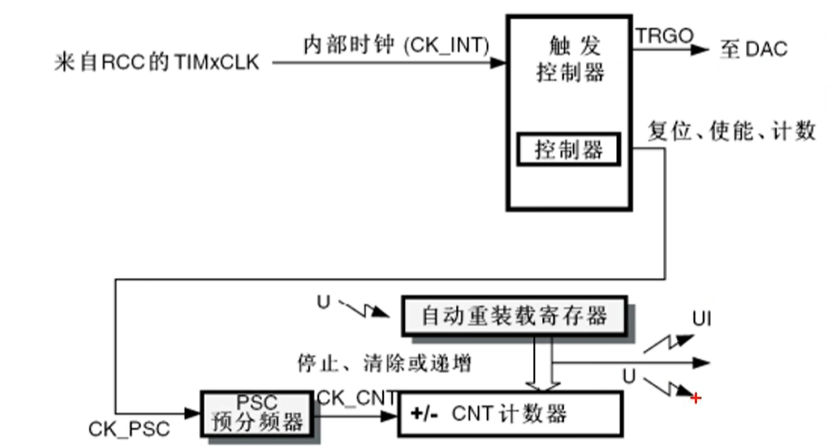
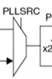
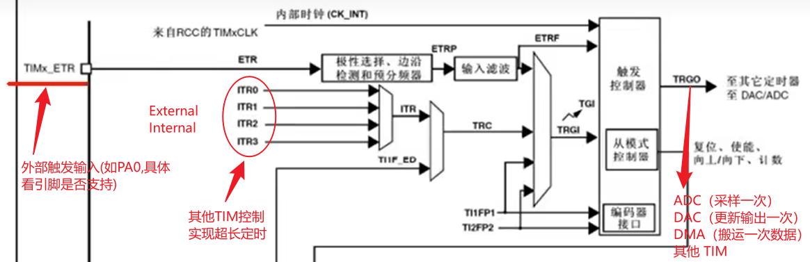
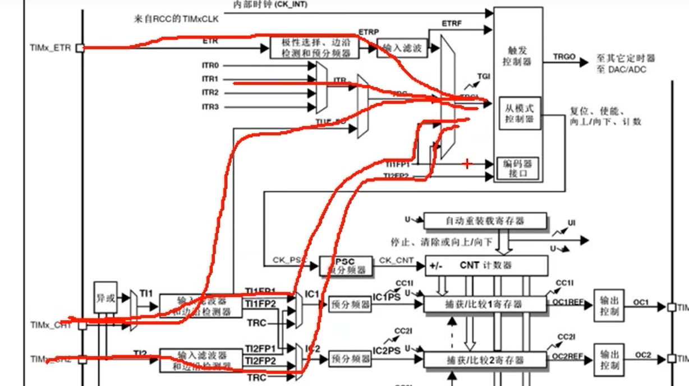
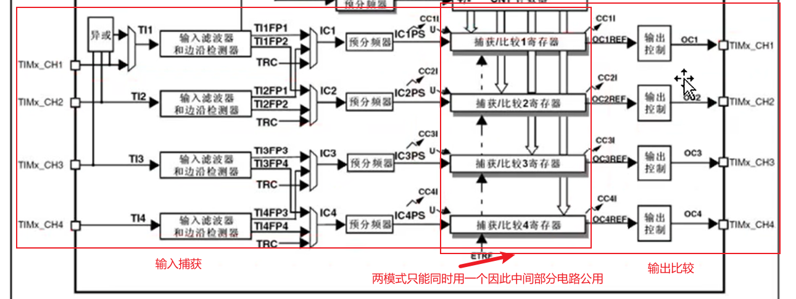
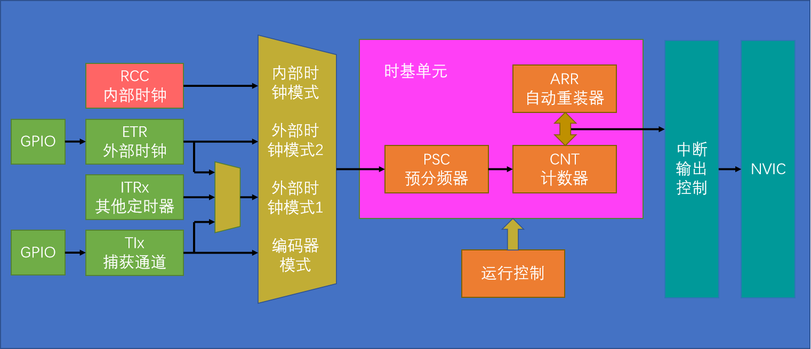
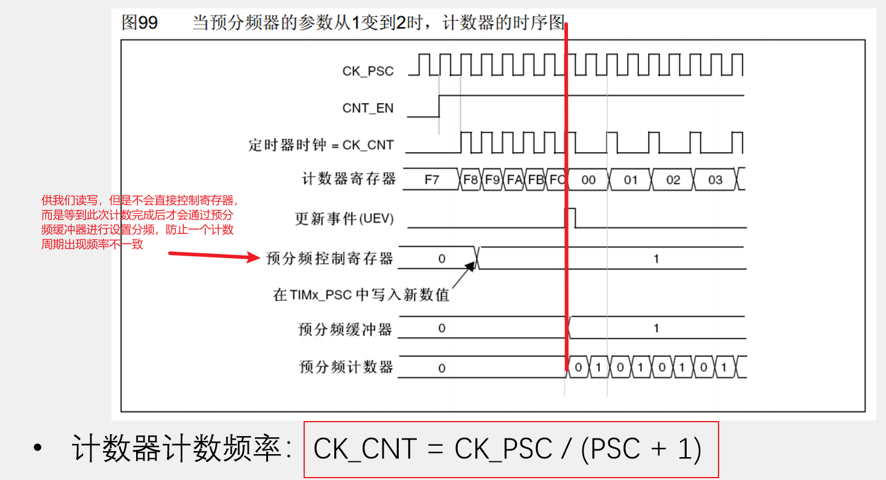

### 1.基本定时器

#### RCC总时钟提供频率，内部时钟分频

#### PSC相当于减速器，用于给频率“降速”

#### CNT达到自动重载设定值时清零重新计数，同时触发中断UI和事件U

#### TRGO为 触发控制器

- ##### TRGO 只是“更新一下 DAC 输出”的提醒信号

- ##### 如果 DAC 数据寄存器的值不变，那么即使 TRGO 一直触发，DAC 输出也不会改变

- #####  如果寄存器的值变了，但没有 TRGO（或无软件触发），DAC 输出不会更新

### 2.通用定时器

多路选择器（Multiplexer，MUX）选择一个

###### 外部时钟模式1可通过一下引脚输入

###### 外部时钟2模式选用TIMx_ETR作为输入

###### 内部时钟几位最上面

##### 输入捕获与输出比较

#### 定时器基本结构

### 3.预分频器时序

#### 预分频缓冲器等于自动加载影子寄存器，在分频器和计数器中均有相关设计，可以通过代码设置

​                                                                                                       $$CK\_CNT\_OV = \frac{CK\_PSC}{(PSC + 1)(ARR + 1)}$$

