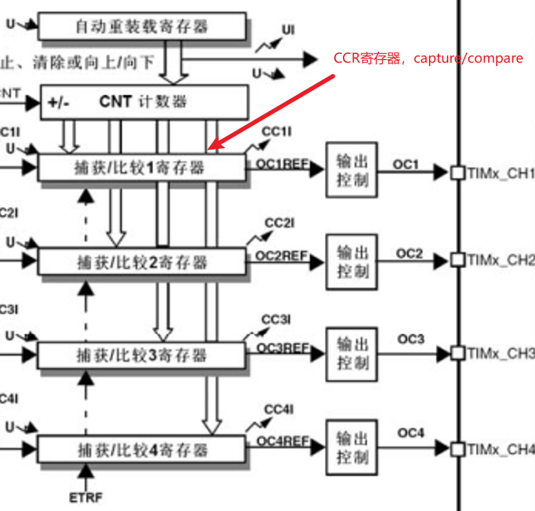
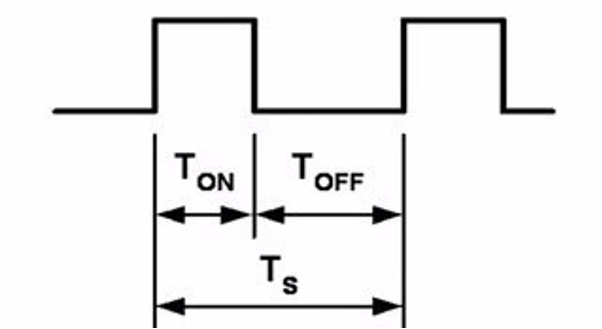

### 1.输出比较寄存器，OC（Output Compare）



​	输出比较可以通过比较CNT与CCR寄存器值的关系，来对输出电平进行置1、置0或翻转的操作，用于输出一定频率和占空比的PWM波形。

### 2.PWM（Pulse Width Modulation）脉冲宽度调制

- 在具有惯性的系统中，可以通过对一系列脉冲的宽度进行调制，来等效地获得所需要的模拟参量，常应用于电机控速等领域

- PWM参数：     频率 = 1 / TS            占空比 = TON / TS           分辨率 = 占空比变化步距



```
PWM只能在惯性系统使用，通过快速改变电平实现模拟不同电压，频率越快效果越好
其中占空比与电压一般是线性关系，比如输入5v，50%的占空比输出就是2.5v
分辨率即占空比改变的最小单位，一般1%够用
```

