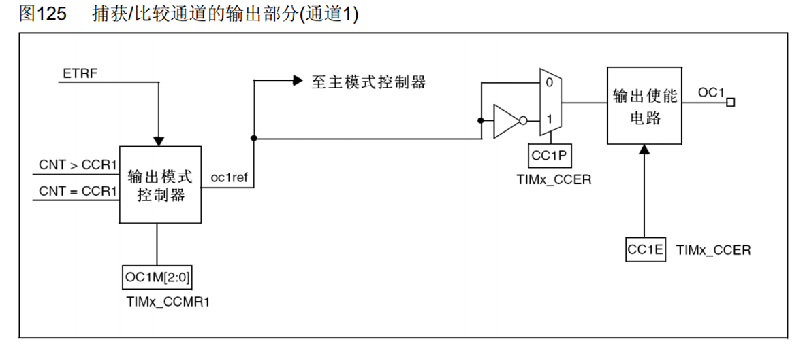
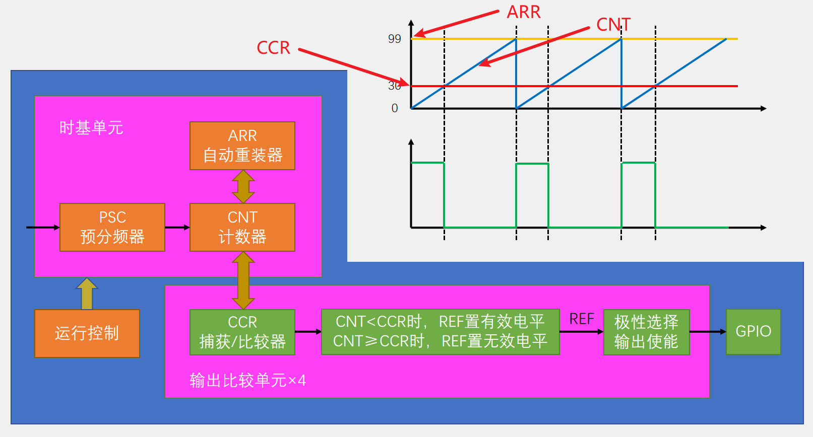
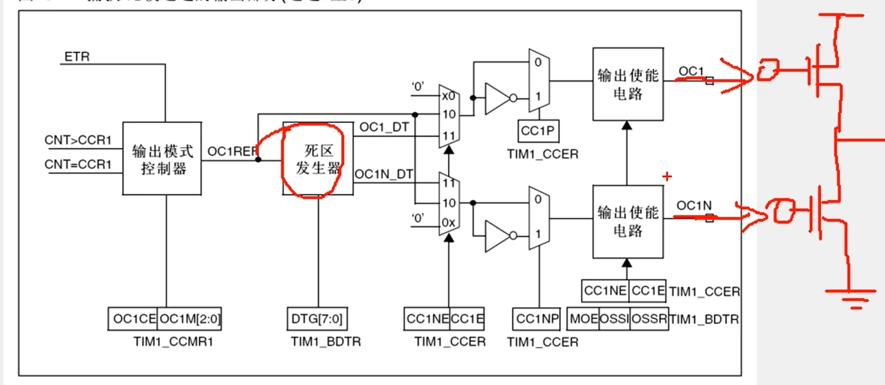

### 1.输出比较寄存器，OC（Output Compare）


​	输出比较可以通过比较CNT与CCR寄存器值的关系，来对输出电平进行置1、置0或翻转的操作，用于输出一定频率和占空比的PWM波形。

### 2.PWM（Pulse Width Modulation）脉冲宽度调制

- 在具有惯性的系统中，可以通过对一系列脉冲的宽度进行调制，来等效地获得所需要的模拟参量，常应用于电机控速等领域

- PWM参数：     频率 = 1 / TS            占空比 = TON / TS           分辨率 = 占空比变化步距


```
PWM只能在惯性系统使用，通过快速改变电平实现模拟不同电压，频率越快效果越好
其中占空比与电压一般是线性关系，比如输入5v，50%的占空比输出就是2.5v
分辨率即占空比改变的最小单位，一般1%够用
```

### 3.输出比较通道



- 使用OC1M进行输出模式控制，oc1ref为参考电压，使用CC1P选择是否翻转，CC1E控制是否输出

##### 输出模式

| 模式             | 描述                                                         |
| :--------------- | :----------------------------------------------------------- |
| 冻结             | CNT=CCR时，REF保持为原状态                                   |
| 匹配时置有效电平 | CNT=CCR时，REF置有效电平                                     |
| 匹配时置无效电平 | CNT=CCR时，REF置无效电平                                     |
| 匹配时电平翻转   | CNT=CCR时，REF电平翻转                                       |
| 强制为无效电平   | CNT与CCR无效，REF强制为无效电平                              |
| 强制为有效电平   | CNT与CCR无效，REF强制为有效电平                              |
| PWM模式1         | 向上计数：CNT<CCR时，REF置有效电平，CNT≥CCR时，REF置无效电平<br>向下计数：CNT>CCR时，REF置无效电平，CNT≤CCR时，REF置有效电平 |
| PWM模式2         | 向上计数：CNT<CCR时，REF置无效电平，CNT≥CCR时，REF置有效电平<br>向下计数：CNT>CCR时，REF置有效电平，CNT≤CCR时，REF置无效电平 |

##### 基本结构



- 通过设置CCR的值来控制占空比
- PWM频率：	    Freq = CK_PSC / (PSC + 1) / (ARR + 1)
- PWM占空比：	Duty = CCR / (ARR + 1)     //到达CCR时就变化了，也就是0到29为高电平，30就变
- PWM分辨率：	Reso = 1 / (ARR + 1)

##### 高级定时器的死区发生器



- 左图手绘区域为一个最基本的推挽电路，两个MOS管为大功率电子开关，上导通下断开即可输出高电平，反之亦然，为了避免上下管同时导通导致器件损坏。OC1断开OC1N导通时，由于OC1断开的短暂延迟会导致瞬间导通，死区发生器用于保证OC1断开后短暂延迟后再接通OC1N
- 上述推挽电路，两个即可实现电机正反转，三个即可实现控制三相电机

