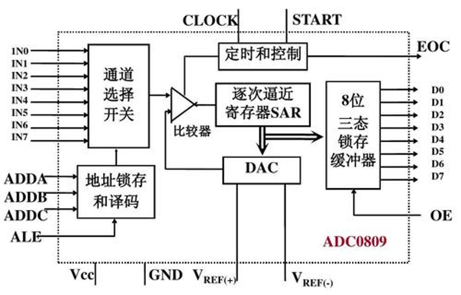
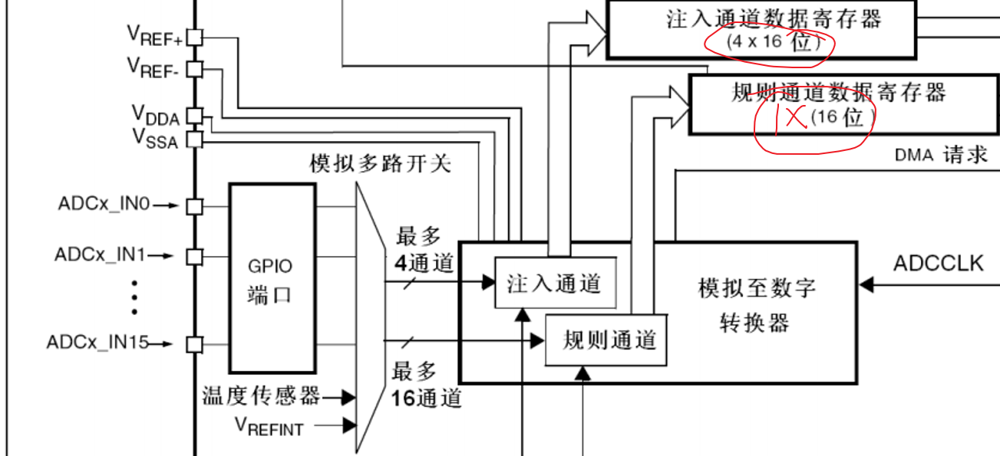
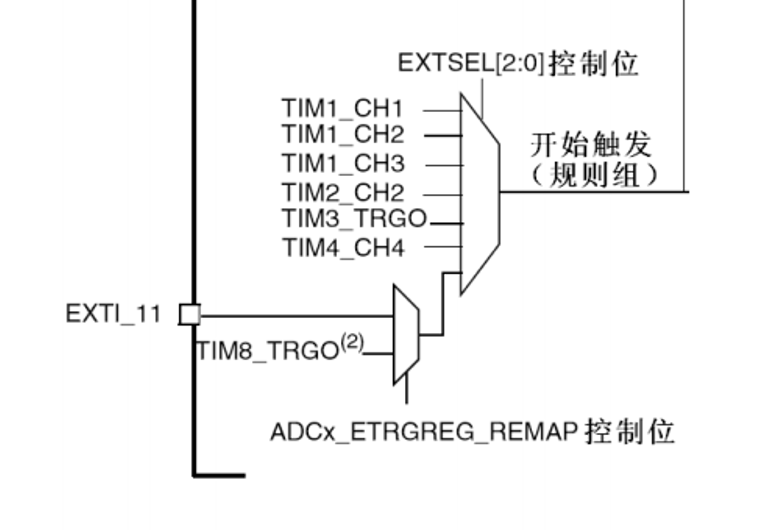
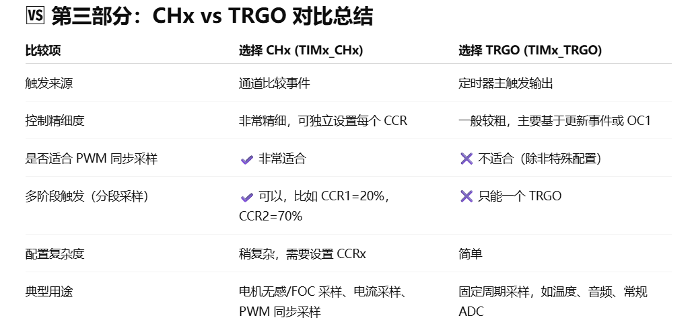
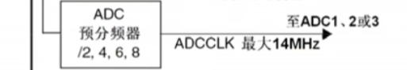
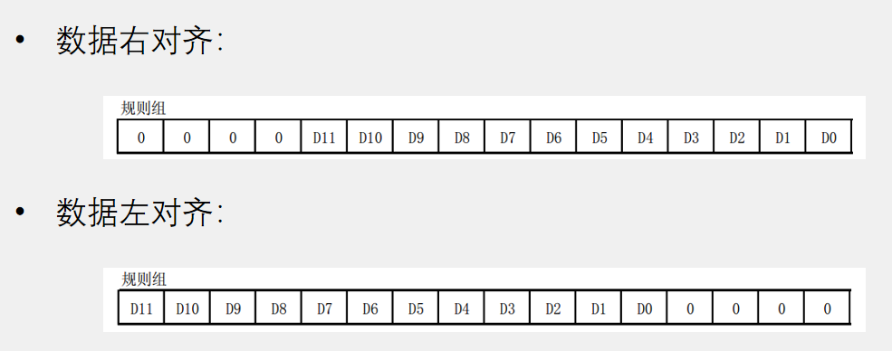

### 一. ADC0809

#### 1. 地址锁存和译码（ADDA / ADDB / ADDC + ALE）
- **地址锁存**：在 ALE 有效时，将外部地址线 ADDA、ADDB、ADDC 上的 3 位地址锁存到芯片内部，  锁存完成后即使外部地址线变化，本次转换使用的通道仍保持不变。
- **地址译码**：把锁存的 3 位地址译码成 8 选 1 的控制信号，用来选择 IN0~IN7 中的某一路模拟输入，  并控制“通道选择开关”把对应通道接入比较器。

---

#### 2. 逐次逼近寄存器（SAR）（12位01表示范围0到4095，这个范围与参考电压线性对应，通过DAC反复调整12位数值来逼近输入电压，dac对应的12位即为电压对应的12位）
- 内部存放当前的“试探数字码”，从最高位到最低位依次试探每一位是 1 还是 0。
- 每试探一位就把该数字码送到 DAC，比较 Vin 和 Vdac：
  - 若 Vin ≥ Vdac，则保留该位为 1；
  - 若 Vin < Vdac，则把该位恢复为 0。
- 完成全部 8 位试探后，SAR 中的内容就是模拟输入电压对应的最终 8 位数字结果。

---

#### 3. DAC（数模转换器）
- 接收来自 SAR 的 8 位数字码，并转换为与之成比例的模拟电压 Vdac。
- 将 Vdac 送入比较器，与选中的通道电压 Vin 比较，为 SAR 的逐次逼近提供依据。
- 在整个转换过程中，DAC 与 SAR 和比较器构成闭环，使 ADC 能在有限时钟周期内快速逼近真实输入电压。

### 二. stm32内部ADC

​	基本结构类似，但是stm32可以一次进行4组（注入组）或16组（规则组）信号转换，其中注入组可以一次输出4个值但是规则组只能同时输出一个，规则组通常配合DMA进行数据转运

### 三. 规则组触发引脚

​	可以通过触发外部中断以及定时器内部硬件实现触发（非中断），一般不使用中断方式

采用内部时钟时，由于内部时钟为72mhz所以只能选择6或者8分频否则造成测量不准确

### 四. 转换模式（见ppt）】

### 五. 数据对齐

​	由于ADC为12位但是对应数字寄存器为16位因此产生两种对齐方式

​	一般采用右对齐直接读出值，左对齐相当于整个数右移4位，整个值扩大了2的4次方

### 六. 转换时间

- AD转换的步骤：采样，保持，量化，编码

- STM32 ADC的总转换时间为：	TCONV = 采样时间 + 12.5个ADC周期

- 例如：当ADCCLK=14MHz，采样时间为1.5个ADC周期	TCONV = 1.5 + 12.5 = 14个ADC周期 = 1μs
