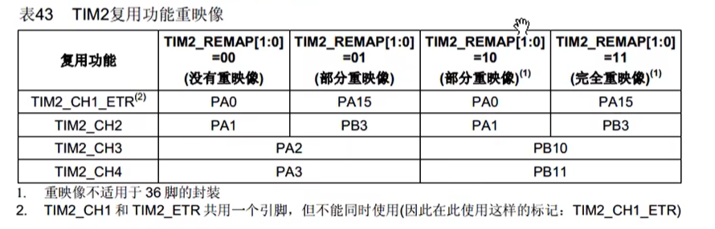

# STM32 AFIO 引脚重映射快速指南

## 1. 什么时候需要 AFIO？
当你想把外设（如 TIM2, USART1）的默认引脚改成芯片支持的另一组引脚时。

## 2. 核心步骤 (三步走)
必须严格按照以下顺序初始化，缺一不可：

1.  **开启 AFIO 时钟**：因为重映射控制器属于 AFIO 外设。
2.  **执行重映射函数**：告诉芯片你要映射到哪里。
3.  **初始化新引脚**：对映射后的目标 GPIO 进行配置。

## 3. 标准代码模板

```c
// 1. 开启时钟 (注意：必须开启 AFIO 时钟)
RCC_APB2PeriphClockCmd(RCC_APB2Periph_AFIO, ENABLE);        // 开启 AFIO
RCC_APB2PeriphClockCmd(RCC_APB2Periph_GPIOB, ENABLE);       // 开启目标引脚时钟 (假设是 GPIOB)

// 2. 配置重映射 (参数需查 stm32f10x_gpio.h 或参考手册)
// 例如：将 TIM2 完全重映射 (Full Remap)
GPIO_PinRemapConfig(GPIO_FullRemap_TIM2, ENABLE);

// 3. 初始化新的 GPIO 引脚
GPIO_InitTypeDef GPIO_InitStructure;
GPIO_InitStructure.GPIO_Pin = GPIO_Pin_10 | GPIO_Pin_11;    // 假设映射到了 PB10, PB11
GPIO_InitStructure.GPIO_Mode = GPIO_Mode_AF_PP;             // 复用推挽输出
GPIO_InitStructure.GPIO_Speed = GPIO_Speed_50MHz;
GPIO_Init(GPIOB, &GPIO_InitStructure);                      // 初始化 GPIOB
```

## 4. 特殊情况：JTAG/SWD 引脚冲突详解

STM32F103 上电复位后，有 5 个引脚默认被配置为调试接口（JTAG/SWD），**不能直接当做普通 GPIO 或 PWM 输出使用**。

如果你重映射后的引脚正好落在这些引脚上，必须配置 AFIO 来“解除调试占用”。

### 4.1 受影响的引脚列表

| 引脚     | 默认功能     | 描述          | 危险程度                      |
| :------- | :----------- | :------------ | :---------------------------- |
| **PA13** | JTMS / SWDIO | 串行调试数据  | **高危** (ST-Link 下载必须用) |
| **PA14** | JTCK / SWCLK | 串行调试时钟  | **高危** (ST-Link 下载必须用) |
| **PA15** | JTDI         | JTAG 数据输入 | 普通 (可解除)                 |
| **PB3**  | JTDO         | JTAG 数据输出 | 普通 (可解除)                 |
| **PB4**  | NJTRST       | JTAG 复位     | 普通 (可解除)                 |

> **注意**：TIM2 的重映射经常用到 PA15 和 PB3；TIM3 的重映射经常用到 PB4。

---

### 4.2 解除占用的三种模式

在代码中使用 `GPIO_PinRemapConfig` 函数时，有三个关于 SWJ (Serial Wire JTAG) 的参数可供选择：

#### 1. 仅解除 PB4 (NJTRST)
* **参数**：`GPIO_Remap_SWJ_NoJTRST`
* **效果**：PB4 变成普通 IO，其他调试功能保留。
* **安全性**：安全。

#### 2. 解除 JTAG，保留 SWD (推荐方案) ✅
* **参数**：`GPIO_Remap_SWJ_JTAGDisable`
* **效果**：**PA15, PB3, PB4** 变回普通 IO。**PA13, PA14** 仍用于 ST-Link 下载。
* **安全性**：安全，最常用的模式。

#### ==3. 完全禁用 (高危) ❌==
* ==**参数**：`GPIO_Remap_SWJ_Disable`==
* ==**效果**：所有 5 个引脚都变成普通 IO。==
* ==**后果**：**ST-Link 无法下载程序**（芯片“变砖”），只能通过按住复位键上电等特殊方法补救。==

---

### 4.3 标准代码示例

假设你要使用 **PB3** 作为 LED 或者 PWM 输出，必须先执行以下代码：

```c
// 1. 开启 AFIO 和 GPIOB 时钟
RCC_APB2PeriphClockCmd(RCC_APB2Periph_AFIO, ENABLE);
RCC_APB2PeriphClockCmd(RCC_APB2Periph_GPIOB, ENABLE);

// 2. 解除 JTAG 调试，保留 SWD (释放 PA15, PB3, PB4)
GPIO_PinRemapConfig(GPIO_Remap_SWJ_JTAGDisable, ENABLE);

// 3. 正常初始化 GPIO (以 PB3 为例)
GPIO_InitTypeDef GPIO_InitStructure;
GPIO_InitStructure.GPIO_Pin = GPIO_Pin_3;
GPIO_InitStructure.GPIO_Mode = GPIO_Mode_Out_PP; // 或者 GPIO_Mode_AF_PP
GPIO_InitStructure.GPIO_Speed = GPIO_Speed_50MHz;
GPIO_Init(GPIOB, &GPIO_InitStructure);
```



